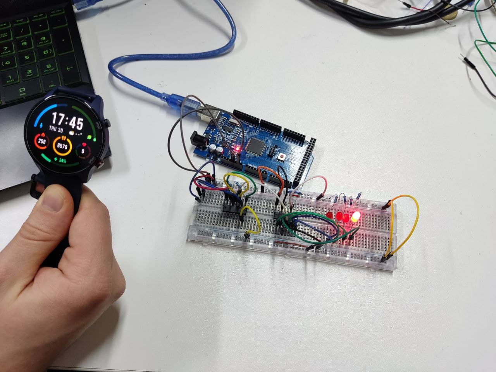

# Lab work 9: Hardware Counter
Author: <a href="https://github.com/bogdanmagometa">Bohdan Mahometa</a>  
Variant: hardware debouncing using SR flip-flop with pull-up resistors.

### Task

Implement 4-bit hardware counter using simple ICs.

The counter is incremented when the state of the switch button changes from off to on.

The implementation must not have switch bouncing.

The current state of the counter is displayed using 4 LEDs.

### Schematic

### Basic Principle of Operation

An SR flip-flop stores the state of the switch (ON/OFF). The output of the SR flip-flop is connected to the UP pin of the counter, so that change of the state from 0 to 1 increments the counter.

I use 7400 IC for creating the SR flip-flop. The switch works in a way that it pulls to the ground either "set" or "reset" inputs of the flip-flop. Due to the fact that at the moment of switching the state changes the first time the set/reset is pulled to ground, the bouncing is elliminated.

### Results

#### The implementation:

# Additional tasks
- not done yet